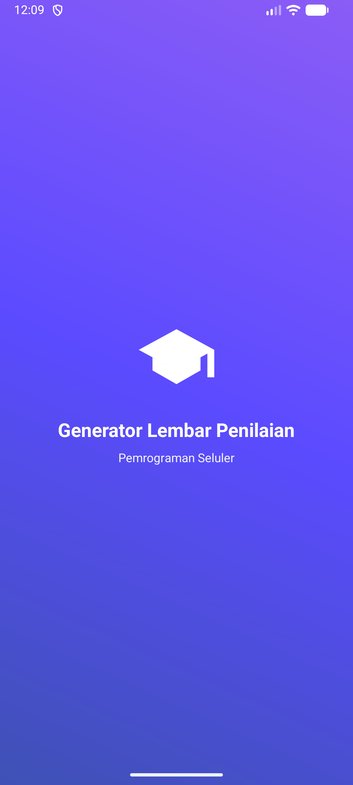
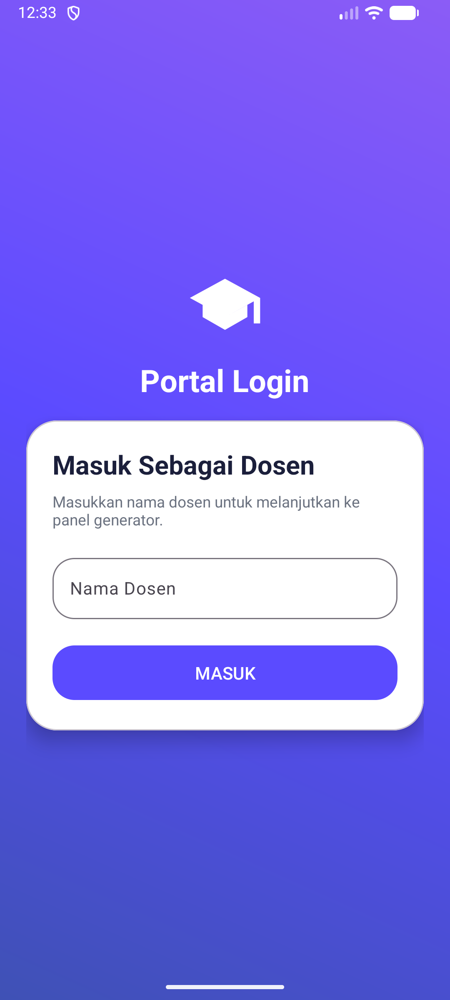
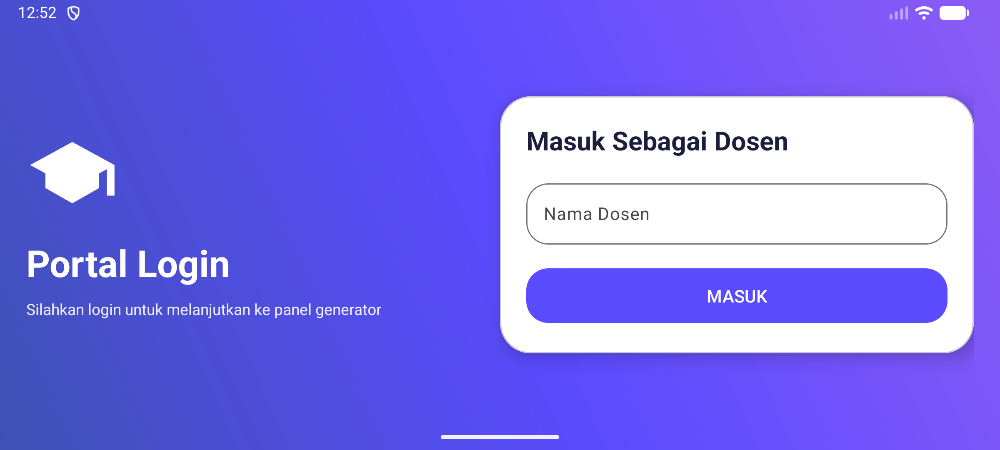
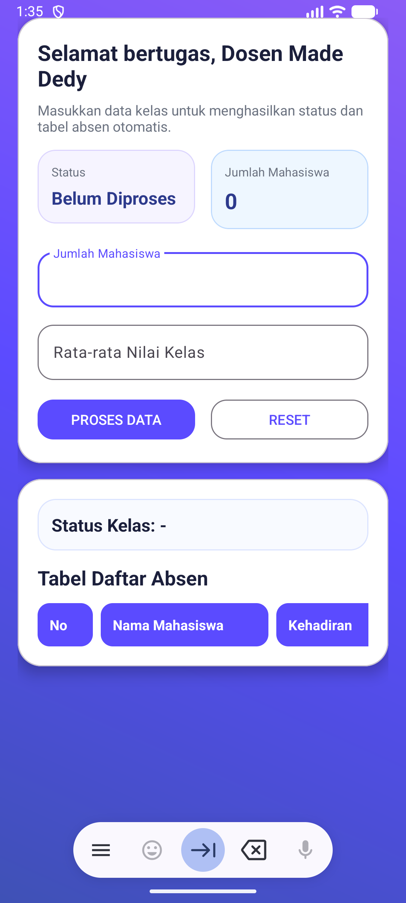
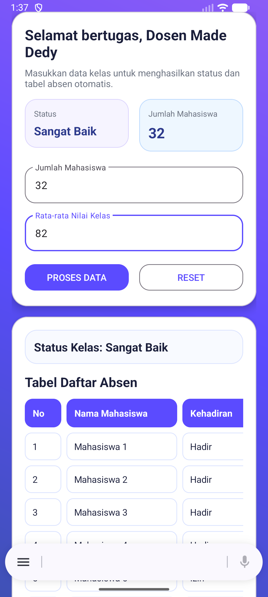
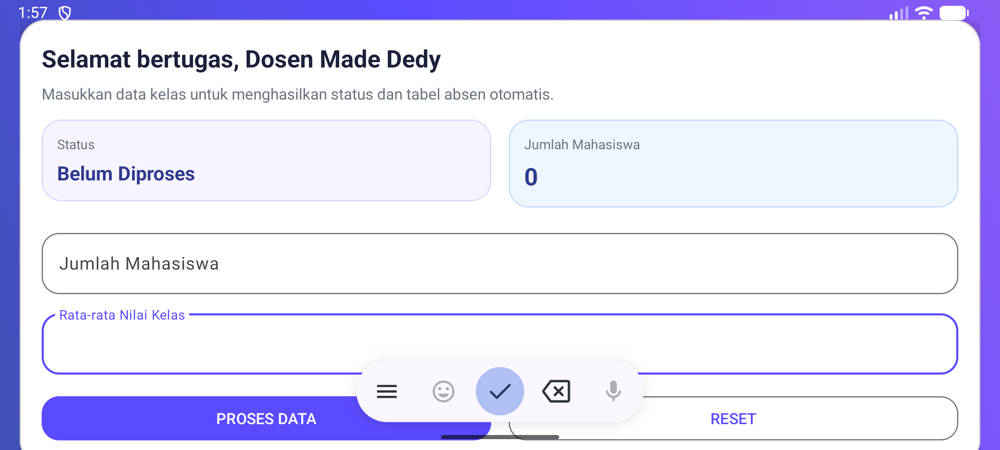
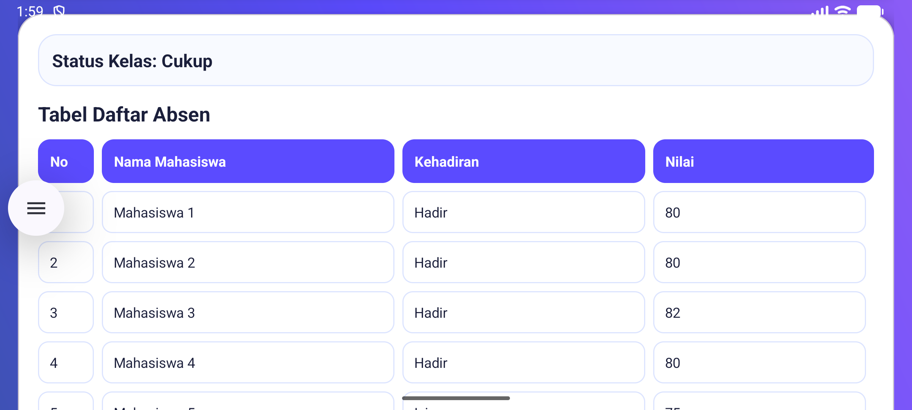

# UTS Pemrograman Seluler - Aplikasi Generator Lembar Penilaian

## Identitas Mahasiswa
- **Nama Lengkap:** I Made Dedy Wanditya
- **NIM:** 42430042
- **Program Studi:** Teknologi Informasi

## Deskripsi Aplikasi
Aplikasi ini dibuat untuk memenuhi Ujian Tengah Semester (UTS) mata kuliah **Pemrograman Seluler** dengan studi kasus **Aplikasi Generator Lembar Penilaian**.

Aplikasi membantu dosen untuk:
- masuk melalui portal login,
- menghasilkan status kelas berdasarkan rata-rata nilai,
- serta menampilkan daftar absen mahasiswa secara otomatis.

Selain memenuhi kebutuhan utama tugas, aplikasi ini juga dibuat dengan tampilan **modern UI** dan tambahan **splash screen** sebagai pembuka aplikasi.

## Fitur Utama Aplikasi

### 1. Halaman Login
- Input **Nama Dosen**
- Tombol **MASUK**
- Tampilan responsif untuk mode **Portrait** dan **Landscape**
- Menggunakan folder `layout-land` agar antarmuka tetap rapi saat perangkat diputar

### 2. Halaman Panel Generator
- Menampilkan sapaan:
    - **"Selamat bertugas, Dosen [Nama]"**
- Input:
    - **Jumlah Mahasiswa**
    - **Rata-rata Nilai Kelas**
- Tombol:
    - **PROSES DATA**
    - **RESET**

### 3. Logika Program
- **If-Else**
    - Jika nilai `>= 80` → **Sangat Baik**
    - Jika nilai `>= 60` → **Cukup**
    - Jika nilai `< 60` → **Kurang**
- **For Loop**
    - Mencetak daftar mahasiswa otomatis dari `1` sampai jumlah mahasiswa yang diinput

### 4. Tampilan Tambahan
- Splash screen modern
- Card UI berbasis Material Design
- Tabel daftar absen yang lebih rapi dan mudah dibaca

## Implementasi Materi
Aplikasi ini mengimplementasikan materi berikut:

- **Modul 2 & 3**
    - Desain antarmuka
    - Layout responsif portrait dan landscape
- **Modul 4**
    - Navigasi antar halaman
    - Pengiriman data menggunakan `Intent`
- **Modul 5**
    - Percabangan `If-Else`
    - Perulangan `For Loop`

## Alur Penggunaan Aplikasi
1. Pengguna membuka aplikasi.
2. Splash screen tampil sebagai pembuka.
3. Pada halaman login, dosen mengisi **Nama Dosen**.
4. Setelah menekan tombol **MASUK**, aplikasi berpindah ke halaman panel generator.
5. Dosen mengisi:
    - jumlah mahasiswa
    - rata-rata nilai kelas
6. Setelah menekan tombol **PROSES DATA**, aplikasi akan:
    - menampilkan status kelas
    - menampilkan daftar absen mahasiswa otomatis
7. Tombol **RESET** dapat digunakan untuk mengosongkan input dan hasil.

## Logika Status Kelas
| Rata-rata Nilai | Status Kelas |
|---|---|
| `>= 80` | Sangat Baik |
| `>= 60` | Cukup |
| `< 60` | Kurang |

## Screenshot Aplikasi

### 1. Splash Screen

### 2. Halaman Login
|                   Mode Portrait                   |                   Mode Landscape                    |
|:-------------------------------------------------:|:---------------------------------------------------:|
|  |  |

### 3. Halaman Panel Generator (Potrait)
|               Sebelum Proses                |                Sesudah Proses                 |
|:-------------------------------------------:|:---------------------------------------------:|
|  |  |

### 4. Halaman Panel Generator (Landscape)
|                    Sebelum Proses                     |                     Sesudah Proses                      |
|:-----------------------------------------------------:|:-------------------------------------------------------:|
|  |  |

## Struktur Fitur Aplikasi
- **SplashActivity**
    - Menampilkan splash screen
- **MainActivity**
    - Halaman login
- **PanelActivity**
    - Halaman generator lembar penilaian

## Teknologi yang Digunakan
- **Kotlin**
- **Android Studio**
- **XML Layout**
- **Material Design Components**

## Cara Menjalankan Aplikasi
1. Clone repository ini.
2. Buka project di Android Studio.
3. Tunggu proses Gradle selesai.
4. Jalankan aplikasi pada emulator atau perangkat Android.
5. Uji fitur login dan panel generator.

## Repository GitHub
[Klik di sini untuk membuka repository](https://github.com/bliDedok/UTS_PemrogSeluler_42430042_Dedy)

## Catatan
- File screenshot disimpan di folder `screenshots/`
- Repository ini dibuat untuk keperluan pengumpulan tugas **UTS Pemrograman Seluler**